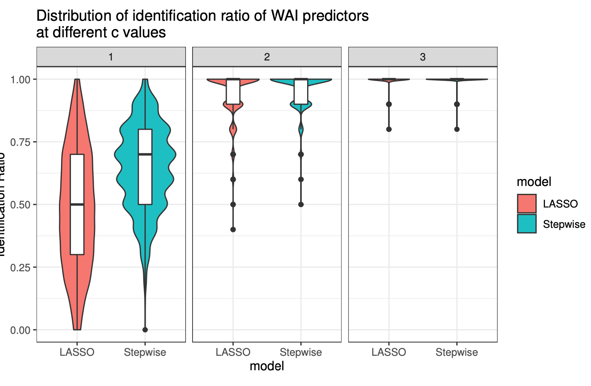
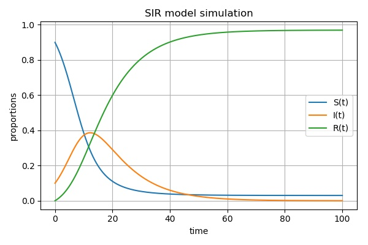

<link rel="stylesheet" href="style.css">

<h2><b>Projects</b></h2>

<table>
<col width="20%">
<col width="30%">
<col width="50%">

<tr style="border-top:1pt solid black;">
  <th rowspan="3"></a></th>
  <td style="vertical-align: bottom">05/2020</td>
  <td style="text-align:right; vertical-align:bottom">Columbia University</td>
</tr>
<tr>
  <td colspan="2" style="height:20px; vertical-align:middle"><h3><b>A Bayesian model of hurrican trajectories</b></h3></td>
</tr>
<tr>
  <td colspan="2">
  
  * <a href="./reports/covid.pdf"><i style="font-size:24px" class="fa">&#xf1c1;</i></a>
  
  * Constructed a bayesian model and calculated the posterior distribution. 
  
  * Implemented coordinatewise Metropolis–Hastings Sampling algorithm and sampled from the posterior to get stable Markov Chain (No package used). 
  
  * Did parameter estimation using the results of Markov Chain and used the parameter to predict other hurricane speed.</td>
</tr>

<tr style="border-top:1pt solid black;">
  <th rowspan="3"></a></th>
  <td style="vertical-align: bottom">04/2020</td>
  <td style="text-align:right; vertical-align:bottom">Columbia University</td>
</tr>
<tr>
  <td colspan="2" style="height:20px; vertical-align:middle"><h3><b>COVID-19 Analysis via Logistic Curve and Clustering</b></h3></td>
</tr>
<tr>
  <td colspan="2">
  
  * <a href="./reports/covid.pdf"><i style="font-size:24px" class="fa">&#xf1c1;</i></a>
  
  * Trained logistic curve model to fit the COVID-19 cases data.
  
  * Estimated parameters using the combination of Ordinary Differential Equation method and Gradient Descent model. First used ODE to get the initial guess and plug into gradient descent to estimate the parameters (No package used). 
  
  * Implemented both Gaussian Mixture Model with EM algorithm and Kmeans algorithm to cluster the estimated parameters for each countries (No package used). 
  
  * Used the clustering results drawing world to visulized the distribution of clusters to see the geometric association.</td>
</tr>

<tr style="border-top:1pt solid black;">
  <th rowspan="3"></a></th>
  <td style="vertical-align: bottom">03/2020</td>
  <td style="text-align:right; vertical-align:bottom">Columbia University </td>
</tr>
<tr>
  <td colspan="2" style="height:20px; vertical-align:middle"><h3><b>Implementation and optimization of algorithms on cancer diagnosis dataset</b></h3></td>
</tr>
<tr>
  <td colspan="2">
  
  * <a href="./reports/cancer.pdf"><i style="font-size:24px" class="fa">&#xf1c1;</i></a>
  
  * Built a predictive model based on Logistic Regression to facilitate cancer diagnosis.
  
  * Trained Logistic Regression models with Newton Raphson, Gradient Decent algorithms from scratch in R (No package used).
  
  * Decreased the misclassification rate by 4%, via implementing a Logistic-LASSO Regression model with Path-wise Coordinate Descent (No package used).</td>
</tr>

<tr style="border-top:1pt solid black;">
  <th rowspan="3"></a></th>
  <td style="vertical-align: bottom">03/2020</td>
  <td style="text-align:right; vertical-align:bottom">Columbia University</td>
</tr>
<tr>
  <td colspan="2" style="height:20px; vertical-align:middle"><h3><b>A prediction model for house saling prices</b></h3></td>
</tr>
<tr>
  <td colspan="2">
  
  * <a href="./reports/house.pdf"><i style="font-size:24px" class="fa">&#xf1c1;</i></a>
  
  * Visualized the data structure and did feature selection.
  
  * Trained both linear models like ridge/lasso regression, pcr regression and non-linear model: MARS regression with tuning parameter selected by cross validation.
  
  * Used resampling methods to get the distribution of RMSE for model selection and chose the best model with minimal RMSE.
  
  * Applied the selected model on the test data to get the test error.</td>
</tr>

<tr style="border-top:1pt solid black;">
  <th rowspan="3"></a></th>
  <td style="vertical-align: bottom">02/2020</td>
  <td style="text-align:right; vertical-align:bottom">Columbia University</td>
</tr>
<tr>
  <td colspan="2" style="height:20px; vertical-align:middle"><h3><b>A simulation study to compare weak signal detection ability with different variable selection methods</b></h3></td>
</tr>
<tr>
  <td colspan="2">
  
  * <a href="./reports/simulation.pdf"><i style="font-size:24px" class="fa">&#xf1c1;</i></a>
  
  * Generated high dimension data containing a combination of “strong”, “weak but correlated” and “weak and independent” predictors from multivariabte normal distribution.
  
  * Applied both Stepwise Forwad selection and LASSO regression to get the identifacation rate of weak signal under different scenario.
  
  * Performed 1000 simulation by changing the threshold of signals and the number of types of predictors.
  
  * Compared the parameter estimation ability by comparing MSE under different scenario.</td>
</tr>

<tr style="border-top:1pt solid black;">
  <th rowspan="3"></a></th>
  <td style="vertical-align: bottom">12/2019</td>
  <td style="text-align:right; vertical-align:bottom">Columbia University</td>
</tr>
<tr>
  <td colspan="2" style="height:20px; vertical-align:middle"><h3><b>Gender Pay Gap Claims by Female Doctors at Houston College of Medicine</b></h3></td>
</tr>
<tr>
  <td colspan="2">
  
  * <a href="./reports/gender.pdf"><i style="font-size:24px" class="fa">&#xf1c1;</i></a>
  
  * Use R to visualize the given data and realize multiple linear regression to quantify associations between salaries and gender as well as any other covariates included in the data.
  
  * Test confounders and interaction terms between gender and other covariates to build the final model and do related stratification analysis.</td>
</tr>

<tr style="border-top:1pt solid black;">
  <th rowspan="3"></a></th>
  <td style="vertical-align: bottom">11/2019-12/2019</td>
  <td style="text-align:right; vertical-align:bottom">Columbia University</td>
</tr>
<tr>
  <td colspan="2" style="height:20px; vertical-align:middle"><h3><b>The Suicide Rate Project</b></h3></td>
</tr>
<tr>
  <td colspan="2">
  
  
  * <a href="https://ys3298.github.io/life_saver.github.io/index.html"><i class="fa fa-internet-explorer" style="font-size:24px"></i></a>
  
  * Use R to produce time-based graphics indicating number of suicide cases related to multiple risk factors based on the gathered data from different source and realize multiple linear regression to find the main effect.
  
  * Make a Crude Suicide Rate map allowing users to toggle between different years and choose gender, demonstrating the changes in the suicide rate over time and visualize regional differences across the U.S.</td>
</tr>

<tr style="border-top:1pt solid black;">
  <th rowspan="3"></a></th>
  <td style="vertical-align: bottom">10/2018-06/2019</td>
  <td style="text-align:right; vertical-align:bottom">East China Normal University</td>
</tr>
<tr>
  <td colspan="2" style="height:20px; vertical-align:middle"><h3><b>Dynamics of Ebola Transmission </b></h3></td>
</tr>
<tr>
  <td colspan="2">
  
  * 
  
  * Use R to produce time-based graphics indicating number of infections, death toll and infectious victims based on infection cases and death data and realize function fitting via linear regression.
  
  * Describe Ebola outbreak with SEIR dynamic system model, studied existence and stability of balance point with MATLAB and verify solution stability in the method of numerical simulation
.</td>
</tr>