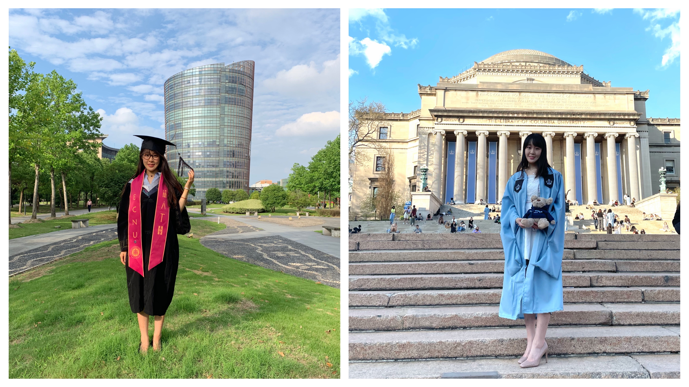

 

# About me
My name is Yimeng Shang. I'm now a second year biostatistics major student in the Mailman School of Public Health in [Columbia University in the city of New York](https://www.columbia.edu/). 

I took courses in Biostatistical method, Probability, Statistical Inference, Causal Inference, Data Science, Clinical Trial Methodology, Survival Analysis, Epidemiology, Adcanced Statistical Computing and Data Mining.

I'm interested in analyzing high-dimensional genomics/metabolomics, imaging, and longitudinal data. My research mainly involves doing variable selection, classification, dimension reduction through penalized regression and statistical learning methods. I'm also interested in statistical computing.

Learn more from [here](aboutme.html) and from my [resume](curriculum_vitae.pdf).

# Contact
Tel: +1 (646)-704-5390 OR +86 153-8826-0313

Email:<ys3298@cumc.columbia.edu> OR <shang_yimeng@163.com>

